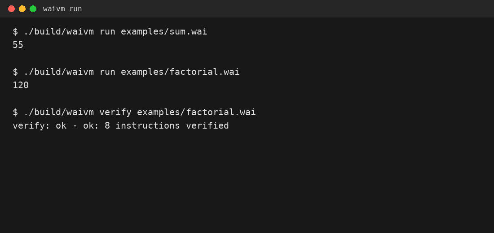
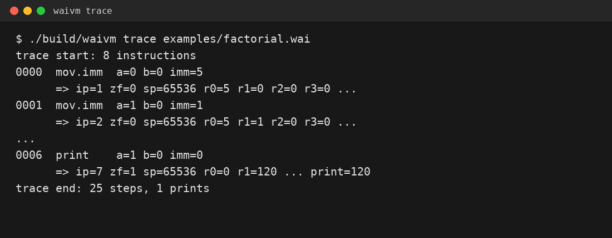
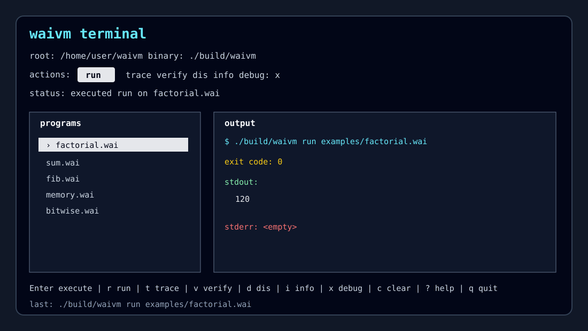

# waivm

Register-based bytecode VM with a handwritten x86-64 assembly execution core.

## Features

- x86-64 NASM VM runtime for normal execution
- C17 assembler and disassembler
- custom `.waibc` bytecode format
- interactive debugger with stepping, breakpoints, register dumps, memory dumps, stack dumps, and disassembly view
- bytecode verifier and instruction-level trace mode
- optional Rust terminal UI for a full terminal-native workflow
- 8 signed 64-bit general-purpose VM registers
- 64 KiB bounds-checked linear memory
- VM stack with `push`, `pop`, `call`, and `ret`
- arithmetic, modulo, branch, compare, and bitwise instructions
- examples, tests, and GitHub Actions CI

## Quickstart

```sh
cmake -S . -B build
cmake --build build
./build/waivm run examples/sum.wai
```

Expected output:

```text
55
```


## Demo





Terminal UI preview:



## Example Program

```asm
; factorial of 5

mov r0, 5      ; counter
mov r1, 1      ; result

loop:
  mul r1, r0
  sub r0, 1
  jnz r0, loop

print r1
halt
```

Run it:

```sh
./build/waivm run examples/factorial.wai
```

Expected output:

```text
120
```

## CLI

```text
waivm run <file.wai|file.waibc>
waivm asm <input.wai> -o <output.waibc>
waivm dis <file.wai|file.waibc>
waivm debug <file.wai|file.waibc>
waivm trace <file.wai|file.waibc>
waivm verify <file.wai|file.waibc>
waivm info <file.waibc>
waivm help
waivm-tui --root . --waivm ./build/waivm
```

Examples:

```sh
./build/waivm asm examples/bitwise.wai -o bitwise.waibc
./build/waivm info bitwise.waibc
./build/waivm dis bitwise.waibc
./build/waivm verify bitwise.waibc
./build/waivm trace examples/factorial.wai
./build/waivm run bitwise.waibc
```

## Instruction Set

| Instruction | Meaning |
|---|---|
| `nop` | no operation |
| `mov rX, IMM/rY` | write immediate or register value |
| `add rX, IMM/rY` | add into register |
| `sub rX, IMM/rY` | subtract from register |
| `mul rX, IMM/rY` | multiply register |
| `div rX, IMM/rY` | signed integer division |
| `mod rX, IMM/rY` | signed integer remainder |
| `and rX, IMM/rY` | bitwise AND |
| `or rX, IMM/rY` | bitwise OR |
| `xor rX, IMM/rY` | bitwise XOR |
| `not rX` | bitwise NOT |
| `shl rX, IMM/rY` | logical left shift, shift count `0..63` |
| `shr rX, IMM/rY` | logical right shift, shift count `0..63` |
| `cmp rX, IMM/rY` | compare and update zero flag |
| `jmp label` | unconditional jump |
| `jz rX, label` | jump if register is zero |
| `jnz rX, label` | jump if register is not zero |
| `je label` | jump if zero flag is set |
| `jne label` | jump if zero flag is clear |
| `load rX, [addr/rY]` | load signed 64-bit value from memory |
| `store [addr/rY], rX` | store signed 64-bit value to memory |
| `push rX` | push register value on VM stack |
| `pop rX` | pop VM stack value into register |
| `call label` | push return address and jump |
| `ret` | pop return address and jump |
| `print rX` | print register value |
| `halt` | stop execution |

Registers are signed 64-bit values. Memory is 64 KiB, byte-addressed, and bounds-checked. `load` and `store` operate on 64-bit little-endian values.

## Bytecode Format

`.waibc` files use a fixed 32-byte little-endian header followed by fixed-width 12-byte instructions.

Header magic:

```text
WAI0
```

Instruction encoding:

| Offset | Size | Field |
|---:|---:|---|
| 0 | 1 | opcode |
| 1 | 1 | operand `a` |
| 2 | 1 | operand `b` |
| 3 | 1 | reserved operand `c` |
| 4 | 8 | signed immediate / target |

Bytecode version: `5`.

Project release: `6.0.0`.

See [`docs/bytecode-format.md`](docs/bytecode-format.md) and [`docs/verifier.md`](docs/verifier.md).

## Architecture

- C owns CLI parsing, source loading, bytecode loading/writing, validation, assembler, disassembler, debugger UX, and tests.
- NASM owns the normal bytecode dispatch loop and executes VM instructions directly against the C-defined VM state.
- The debugger uses a C stepping engine so it can stop between instructions, inspect state, and resume predictably.

See [`docs/architecture.md`](docs/architecture.md) and [`docs/vm-abi.md`](docs/vm-abi.md).

## Debugger

Start the debugger:

```sh
./build/waivm debug examples/call.wai
```

Useful commands:

```text
help
regs
ip
dis
mem <addr> [bytes]
stack [count]
step
continue
break <ip>
clear <ip>
quit
```

See [`docs/debugger.md`](docs/debugger.md).

## Verifier and Trace Mode

Validate source or bytecode without executing it:

```sh
./build/waivm verify examples/sum.wai
```

Trace execution step by step:

```sh
./build/waivm trace examples/factorial.wai
```

See [`docs/verifier.md`](docs/verifier.md) and [`docs/trace.md`](docs/trace.md).

## Terminal UI

v6 adds an optional terminal-native Rust application:

```sh
cargo build --manifest-path tui/Cargo.toml --release
./tui/target/release/waivm-tui --root . --waivm ./build/waivm
```

The TUI lets you browse programs, run, trace, verify, disassemble, inspect bytecode metadata, and temporarily jump into the existing interactive debugger.

It deliberately does **not** use React, a browser, or a web UI. It is a terminal application using ANSI/stty terminal control and shells out to the real `waivm` CLI.

See [`docs/terminal-ui.md`](docs/terminal-ui.md) and [`tui/README.md`](tui/README.md).

## Build

Dependencies:

- CMake 3.20+
- C17 compiler
- NASM
- Make or Ninja
- Linux x86-64
- optional: Rust/Cargo for `waivm-tui`

```sh
cmake -S . -B build
cmake --build build
```

Optional terminal UI:

```sh
cargo build --manifest-path tui/Cargo.toml --release
./tui/target/release/waivm-tui --root . --waivm ./build/waivm
```

Optional CMake target:

```sh
cmake -S . -B build -DWAI_BUILD_TUI=ON
cmake --build build --target waivm_tui
```

## Tests

```sh
ctest --test-dir build
```

Tests cover assembler parsing, VM execution, bytecode write/read, disassembly, debugger command flow, verifier behavior, trace mode, malformed bytecode rejection, golden example outputs, stack/call behavior, memory behavior, bitwise/modulo behavior, terminal UI cargo checks, and basic error handling.

## Roadmap

See [`docs/roadmap.md`](docs/roadmap.md).

## Status

waivm is experimental but functional.

Current:

- register VM
- arithmetic, modulo, bitwise, branch, compare, memory, stack, and call instructions
- C17 assembler
- `.waibc` bytecode loader/writer
- disassembler
- interactive debugger
- bytecode metadata `info` command
- bytecode verifier
- instruction-level trace mode
- optional Rust terminal UI
- handwritten NASM execution loop for Linux x86-64
- example programs
- test harness and CI configuration

Not implemented yet:

- heap allocation
- strings
- function stack frames or calling convention beyond raw `call`/`ret`
- JIT compilation
- Windows runtime
- inline source editing in the terminal UI
- source-level debugger symbols
- formal control-flow analysis beyond structural verification

## License

MIT
